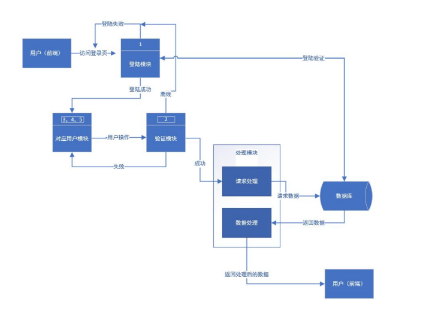
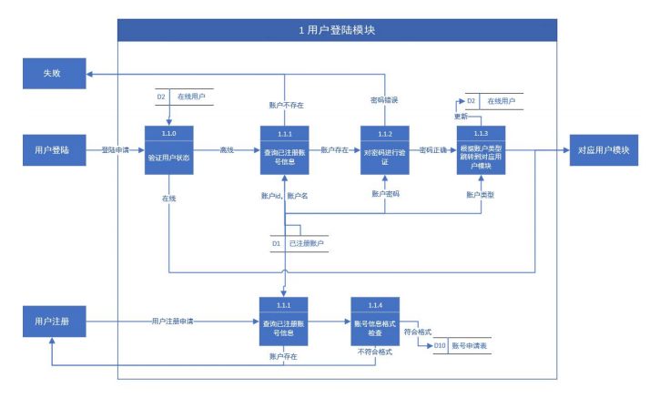
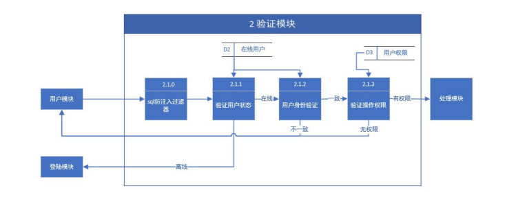
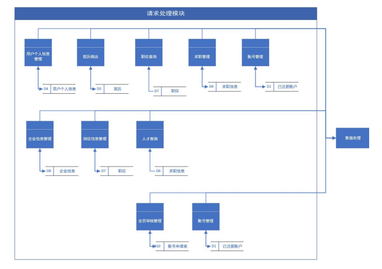

# software_learn
软件工程项目：人才招聘系统

## 组织架构
队伍：软件学习加油队 \
组长：付翔宇\
组员：冯彬 孟维汉 翟江浩 杨雨泽\
[项目地址以及成员账号](文档/项目地址以及成员账号.txt)

## 项目时间
2025年上半年

## 实验环境
jdk + Tomcat + Mysql + Webstorm（前端框架） + Intellij IDEA（ide）

## 仓库目录树
```
tree -a
```


## 项目文档查找

[可行性分析（研究）报告（FAR）ver](文档/报告/可行性分析(研究)报告(FAR)ver.pdf可行性分析(研究)报告(FAR)ver.pdf) 
[可行性分析报告成员分工情况](文档/报告/成员分工情况（可行性分析报告）.txt)  
[软件需求规格说明（SRS）.docx](文档/报告/软件需求规格说明(SRS).docx)  
[软件需求规格说明（SRS）.pdf](文档/报告/软件需求规格说明(SRS).pdf)  
[软件需求规格说明成员分工情况](文档/报告/成员分工情况（软件需求规格说明）.txt)

## 人才招聘系统简介
****
### 一、背景：
  随着中国教育高质量发展以及网络的兴起与应用，市场上涌现出越来越多的人才，为了优化招聘流程、提高招聘效率，并提升人才招募的质量，现需要开发一套全面、易用、高效的人才招募系统。
****
### 二、项目概述：
  人才招募系统（Talent Recruitment System，TRS）是一款用于优化招聘流程的智能化平台，旨在高效连接招聘方与求职者，提升人才匹配的精准度和招聘效率。该系统不仅为求职者提供丰富的岗位信息和智能化的查询功能，还为招聘方搭建便捷的简历筛选与管理平台，助力企业快速找到符合需求的人才。为此，本项目旨在打造一个能够快速定位目标岗位和求职者的智能化平台，将零散的招聘信息进行系统化整合，使其更加直观、合理，从而提升招聘与求职双方的工作效率，实现精准匹配。
****
### 三、项目预期框架
**** 

****

****

****



